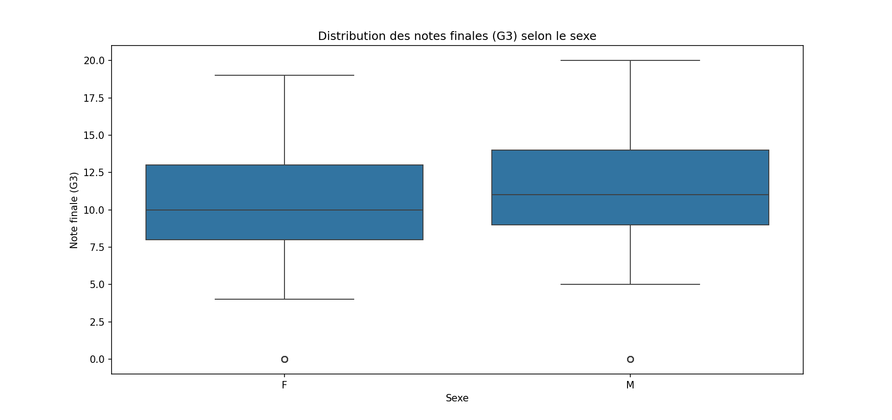
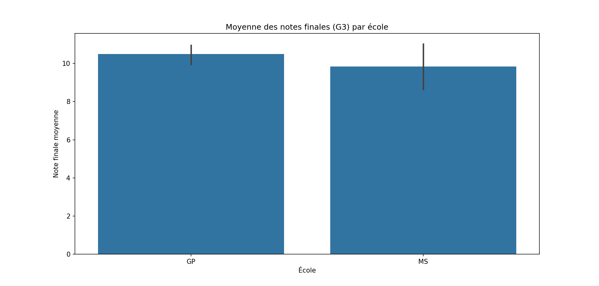
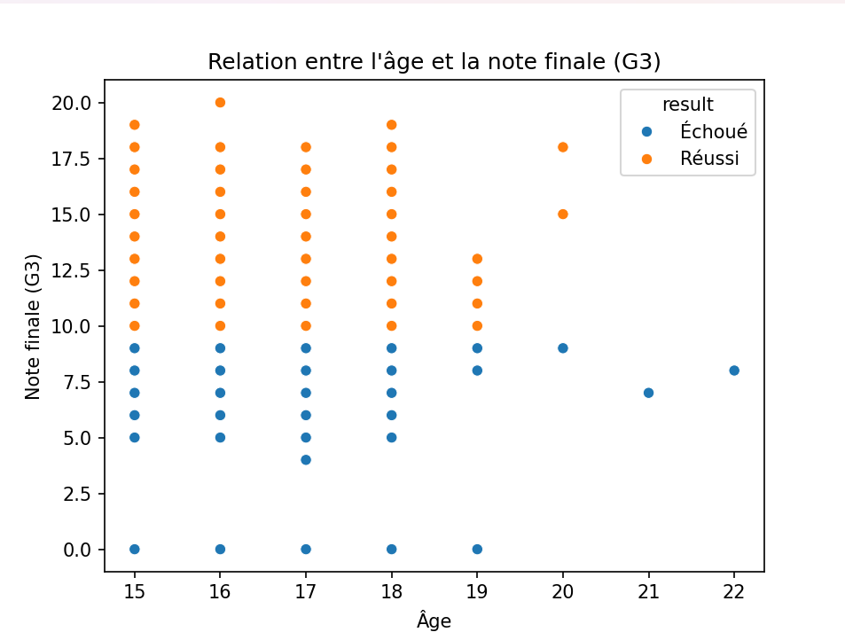
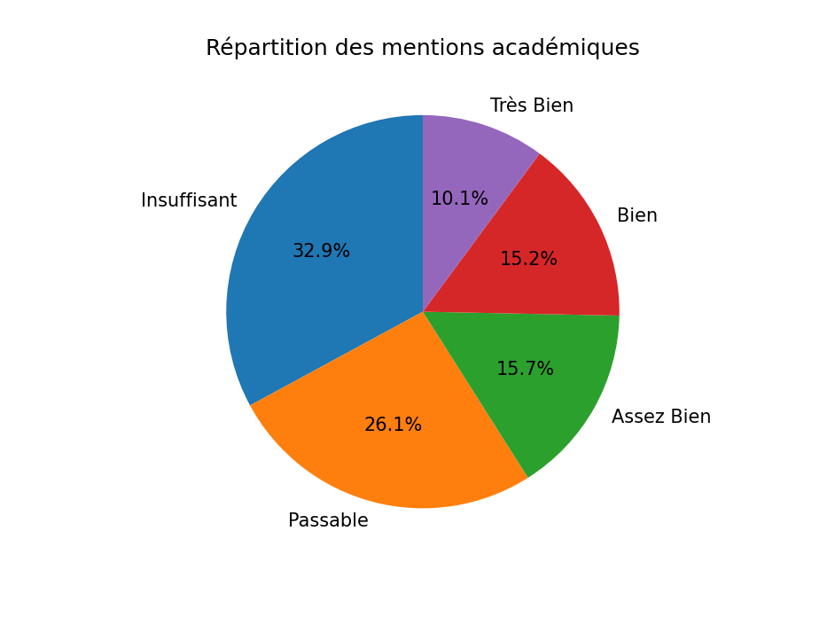

# 🎓 Student Analysis Project

## 📌 Description
This project analyzes student data using Python.  
It helps understand performance, averages, and other insights from a dataset.

## 🛠️ Technologies Used
- Python
- Pandas

## 📂 Files
- Analyse.py → Main script
- student_data.csv → Dataset

  
## 📊 Visualizations

### 🎯 Distribution des notes (G3) selon le sexe


### 🏫 Moyenne par école


### 📈 Relation âge - note


### 🧾 Répartition des mentions



## ▶️ How to Run
```bash
python Analyse.py
